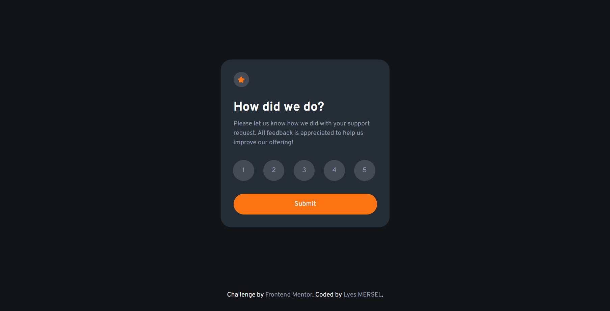

# Frontend_Mentor_Challenge_03
Interactive Rating Component

# Frontend Mentor - Interactive Rating Component Solution
This is a solution to the [QR code component challenge on Frontend Mentor](https://www.frontendmentor.io/challenges/interactive-rating-component-koxpeBUmI). Frontend Mentor challenges help you improve your coding skills by building realistic projects. 

### Screenshot

### Built with
- HTML5
- CSS
- JS
- Jquery

## Author
- Website - [Portfolio](https://lyes-mersel.netlify.app)
- Github - [@lyes-mersel](https://github.com/lyes-mersel)
- Frontend Mentor - [@lyes-mersel](https://www.frontendmentor.io/profile/lyes-mersel)
- LinkedIn - [@lyes-mersel](https://www.linkedin.com/in/lyes-mersel/)